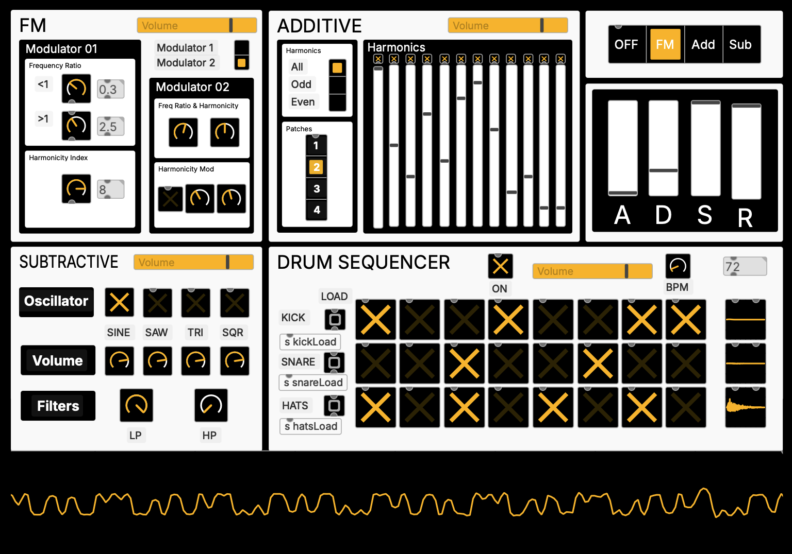
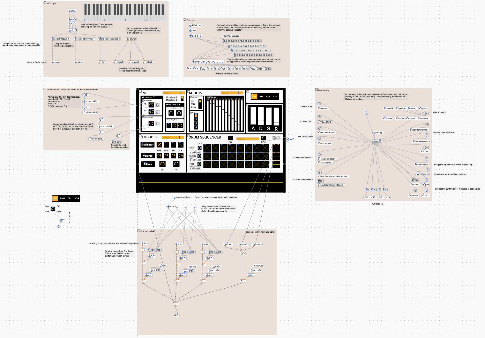

# plugdata Synthesiser

A polyphonic synthesiser built in plugdata (a Pure Data based environment) combining FM, additive and subtractive synthesis in a single interface, with 4-note polyphony via MIDI input. It includes an integrated ADSR envelope for shaping dynamics and a drum sequencer for creating rhythmic backing patterns.

## Screenshot

## Requirements

- plugdata v0.9.2 (based on Pd 0.55.2), standalone or as a plugin. Free and open source: plugdata.org
- A MIDI input device

## Getting started

Open the main patch and choose a synthesiser in the top right-hand corner. The ADSR controls on the right-hand side adjust the amplitude envelope for each synthesiser. Attack, decay and release can be set up to a maximum of 4 seconds.

The drum sequencer operates independently of the synthesisers, allowing an 8-step sequence to be programmed as a backbeat.

## FM Synthesiser

The carrier frequency is controlled by MIDI key input. Two modulators are available to modulate the carrier frequency.

The first modulator has controls for frequency ratio, selectable either between 0 and 0.9 in 0.1 increments or between 1 and 5 in 0.5 increments. The harmonicity index can be set between 1 and 10.

The second modulator is not restricted to fixed increments and can be freely adjusted, allowing a wider range of timbres. It includes a secondary modulation stage that can modulate the harmonicity index of the first modulator. When this is enabled, the first harmonicity control is disabled.

For best results, use a low-frequency carrier tone, sustain a note, and experiment with the frequency ratio and harmonicity modulation controls.

## Additive Synthesis

Preset configurations allow selection between odd, even or full harmonic series. Individual harmonic sliders can be adjusted to shape the resulting timbre.

## Subtractive Synthesis

Four waveforms can be selected and blended: sine, sawtooth, triangle and square. Each waveform has independent amplitude control. High-pass and low-pass filters can be applied to shape the sound.

## Drum Sequencer

On opening the patch, use the load buttons to assign samples to each sequencer row. Kick, snare and hi-hat samples are NOT provided.

Once loaded, activate the sequencer and select steps to build a pattern. The BPM control is on the right-hand side.
